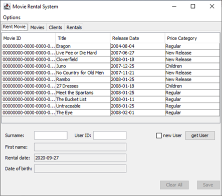

# Movie Rental System

## Description

This project contains an extended Version of the famous Movie Rental System application.
It is extended in the sense that, 
- it is implemented as a distributed application
- uses a database to store the data, 
- implements a REST server to access the data from remote
- implements integration test, database tests and REST API tests

## Purpose
This project is used in the Module Software Testing an Quality Management (STQM) https://www.fhnw.ch/plattformen/stqm/ as a case study to practice various testing techniques and continous integration.

## Pre-requisites

Besides the Java version specified in the Maven POM file of the project, you need to install a PostgreSQL DB to run the application with its tests. If you haven't yet installed one; do it now. 
You find the download and installation instructions on https://www.postgresql.org/download/. 

## Verify the automated Build with Maven 

verify that the application is successfully build with maven.
> mvn verify

All tests should successfully pass.

## Run the application

You can start the application in two ways: 
- as a server application, or 
- as a desktop GUI application.

### 1.	Starting as a server App
Start the application locally, e.g. from within your IDE as a server-appplication. 
You can start the file Application.java in the package ch.fhnw.swc.mrs. There is little to see (except in the console), because it launches a web server. Note, however, the console output: There, among other things, you see under which port the web server is available on locahost!

for eclipse, this might look like:

In your web browser navigate to the URL 
> “localhost:\<port number\>/users” 
 
A web GUI does not exist yet, you directly access REST API and get a response in JSON format.

You should get the list of users which can rent a video as a result:

`
[{"id":"20000000-0000-0000-0000-000000000001","name":"Meier","firstname":"Pia","birthDate":"1987-10-04"},{"id":"20000000-0000-0000-0000-000000000002","name":"Locher","firstname":"Bernhard","birthDate":"1998-01-01"},{"id":"20000000-0000-0000-0000-000000000003","name":"Meier","firstname":"Sami","birthDate":"2009-04-16"},{"id":"20000000-0000-0000-0000-000000000004","name":"Müller","firstname":"Rita","birthDate":"1965-01-24"},{"id":"20000000-0000-0000-0000-000000000005","name":"Meyer","firstname":"Daniela","birthDate":"2008-11-20"},{"id":"20000000-0000-0000-0000-000000000006","name":"Frei","firstname":"Karin","birthDate":"1997-06-05"},{"id":"20000000-0000-0000-0000-000000000007","name":"Otto","firstname":"Peter","birthDate":"1974-03-25"},{"id":"20000000-0000-0000-0000-000000000008","name":"Senderos","firstname":"Albin","birthDate":"1948-05-03"},{"id":"20000000-0000-0000-0000-000000000009","name":"Rieder","firstname":"Trury","birthDate":"1984-12-31"},{"id":"20000000-0000-0000-0000-00000000000a","name":"Sorg","firstname":"Manuela","birthDate":"1996-10-10"},{"id":"20000000-0000-0000-0000-00000000000b","name":"Schwaiger","firstname":"Wolfgang","birthDate":"2012-07-02"},{"id":"20000000-0000-0000-0000-00000000000c","name":"Müller","firstname":"Theo","birthDate":"1974-05-23"},{"id":"20000000-0000-0000-0000-00000000000d","name":"Meier","firstname":"Timothy","birthDate":"1988-08-18"},{"id":"20000000-0000-0000-0000-00000000000e","name":"Huber","firstname":"Roland","birthDate":"2017-08-01"}]
`

### 2. Starting a s Desktop GUI
Start the GUI application with the class MovieRentalSystem in the package ch.fhnw.swc.mrs. Then you should see the following GUI.
 
 

## Run the tests
The project comes already with some unit, integration and API tests. 

- [ ] Execute the unit tests from within your IDE. All test should be green
- [ ] Execute the unit, integration and API tests with "mvn verify"; all tests should be green.

Refresh: Why is mvn test not enough to execute all tests?

## Authors
Christoph Denzler and Martin Kropp.

